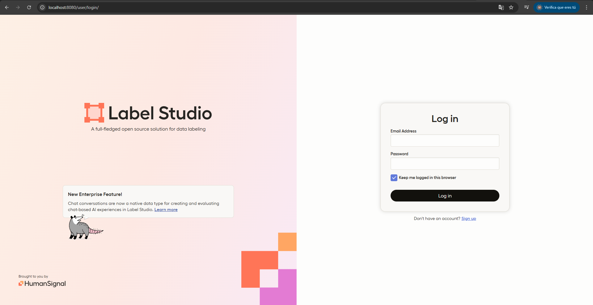
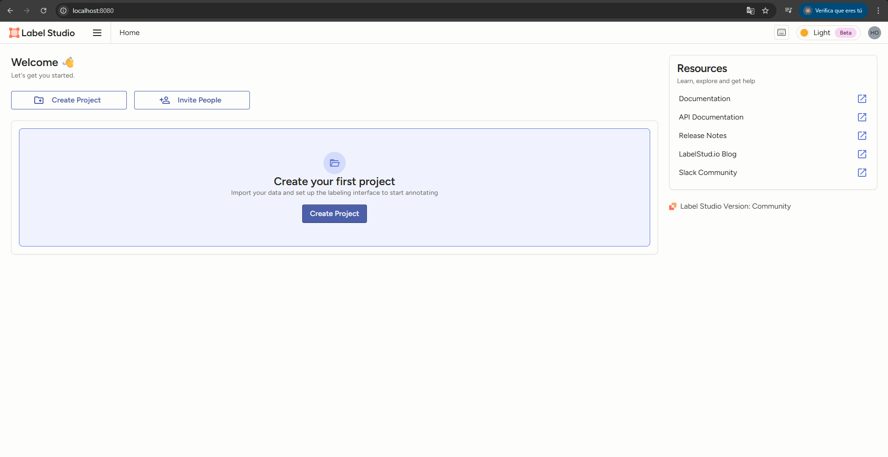

# PROYECTO DE MODELO DE DETECCIÓN DE OBJETOS

Este proyecto se basará en el entrenamiento de **YOLO** para detección de objetos.

## REQUISITOS PREVIOS

Para poder hacer este proyecto de manera eficaz, se recomienda disponer de Anaconda, un gestor de entornos python que nos permite disponer de las versiones óptimas tanto de python como de las librerías para que el programa funcione sin fallos de incompatibilidad entre librerías.

Por ello, el primer paso es tener Anaconda instalado en nuestro dispositivo, en caso de no tenerlo, puedes descargarlo desde [este enlace](https://www.anaconda.com/download).

Una vez instalado creamos el entorno de python desde el que trabajaremos mediante el siguiente comando (**en caso de no tenerlo ya creado**), el cual se ha de ejecutar desde Anaconda prompt, o desde un powershell habilitado para ejecución de comandos Anaconda: 

```bash

# Creamos el entorno indicando el nombre y la versión de python deseada
conda create --name nombreEntorno python=3.12

```

Lo siguiente una vez creado es activarlo, que podemos hacer de la siguiente manera:

```bash

# Activar el entorno creado
conda activate nombreEntorno

```

Y una vez probado todo, desactivar el entorno:

```bash

# Desactivar el entorno creado
conda deactivate

```

## ETIQUETADO DE LAS IMÁGENES

Para el etiquetado de las imágenes utilizarmos una herramienta de python de código abierto que llamada label studio, que se instalaría de la siguiente manera (como puede verse también en la [página oficial](https://labelstud.io/)):

```bash

# Instalamos los paquetes dentro del entorno python en de Anaconda
pip install -U label-studio

# Lo lanzamos a ejecución
label-studio

```

Una vez lanzado a ejecución, se nos abrirá una ventana en el navegador como la que se ve a continuación:



Como se ve, esto se lanza en un servidor local, por lo que lo ideal es registrarse con un correo inventado, ya que no requiere de verificación al tratarse de un daemon al que únicamente nos podemos conectar de manera local.

Una vez registrado, el siguiente paso es iniciar sesión con el correo y contraseña del registro, y accederemos a la ventana de los proyectos:



En esta ventana tendríamos que crear el proyecto y añadir las imágenes que deseamos etiquetar, que, idealmente tendríamos que tener en una carpeta.

Una vez añadidas, debemos crear las clases, en la que quermos clasificar los objetos a identificar en las imágenes.