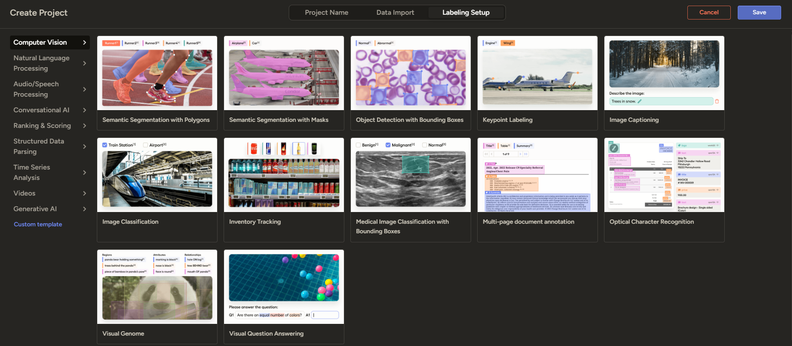
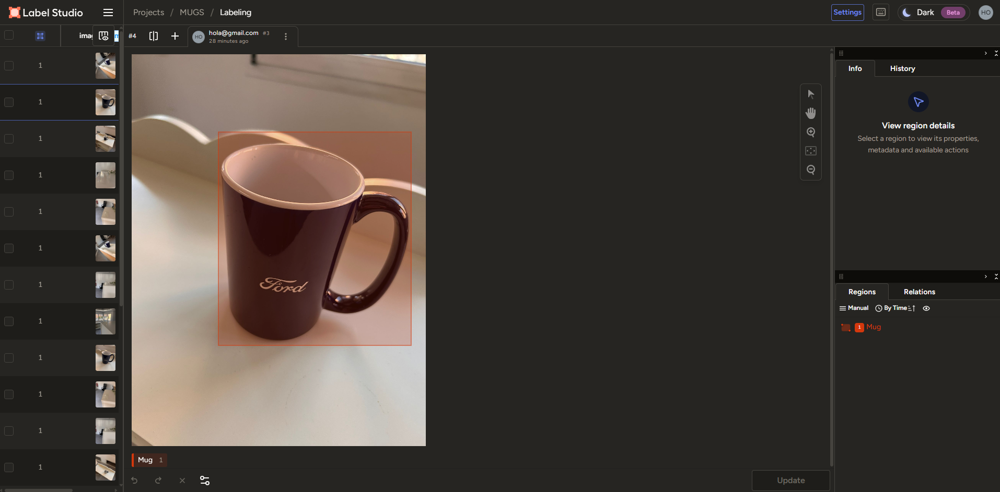
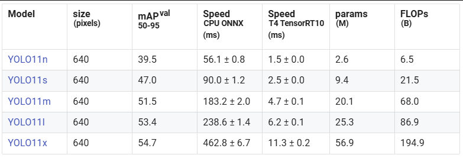

# 🧠 PROYECTO DE PRUEBA DE DETECCIÓN DE OBJETOS

Este proyecto tiene como objetivo **entrenar un modelo YOLO** (You Only Look Once) para la **detección de objetos en imágenes personalizadas**, creando un flujo completo desde el **etiquetado de datos** hasta el **entrenamiento final del modelo**.  

Se utiliza **Label Studio** para generar las anotaciones en formato YOLO y la librería **Ultralytics** para gestionar el entrenamiento y validación del modelo, permitiendo su ejecución tanto en **PC como en dispositivos embebidos** (como Raspberry Pi).  

El propósito final es disponer una plantilla para un **modelo funcional y adaptable**, capaz de reconocer objetos definidos por el usuario en distintos entornos, con un proceso de entrenamiento **reproducible, automatizado y optimizado** dentro de un entorno virtual controlado mediante **Anaconda**. 

---

## ENTORNO VIRTUALIZADO DE EJECUCIÓN

Para poder hacer este proyecto de manera eficaz, se recomienda disponer de ***Anaconda***, un **gestor de entornos python** que nos permite disponer de las **versiones óptimas** tanto de *python* como de las *librerías* para que el programa funcione sin fallos de incompatibilidad entre librerías.

Por ello, el **primer paso** es *tener Anaconda instalado* en nuestro dispositivo, en caso de no tenerlo, puedes descargarlo desde [**este enlace**](https://www.anaconda.com/download).

***Una vez instalado*** **creamos el entorno de python** desde el que trabajaremos mediante el siguiente comando (**en caso de no tenerlo ya creado**), el cual *se ha de ejecutar desde Anaconda prompt, o desde un powershell habilitado* para ejecución de comandos Anaconda: 

```bash

# Creamos el entorno indicando el nombre y la versión de python deseada
conda create --name nombreEntorno python=3.12

```

Lo **siguiente** una vez creado **es activarlo**, que podemos hacer de la siguiente manera:

```bash

# Activar el entorno creado
conda activate nombreEntorno

```

Y una vez probado todo, **desactivar** el entorno:

```bash

# Desactivar el entorno creado
conda deactivate

```

---

## ETIQUETADO DE LAS IMÁGENES

Para el etiquetado de las imágenes utilizarmos una **herramienta** de python de **open source** que llamada ***label studio***, que se instalaría de la siguiente manera (como puede verse también en la [página oficial](https://labelstud.io/)):

```bash

# Instalamos los paquetes dentro del entorno python en de Anaconda
pip install -U label-studio

# Lo lanzamos a ejecución
label-studio

```

Una vez lanzado a ejecución, se nos abrirá una ventana en el navegador como la que se ve a continuación.


Como se ve, esto se lanza en un **servidor local**, por lo que lo ideal es registrarse con un correo inventado, ya que *no requiere de verificación al tratarse de un **daemon** al que únicamente nos podemos conectar de manera local*.

Una vez registrado, el **siguiente paso es iniciar sesión con el correo y contraseña del registro**, y accederemos a la ventana de los proyectos, pero **si ya** anteriormente **has iniciado sesión**, aunque hayas cerrado el programa, p*asas directamente a la ventana de proyectos*.


En esta ventana tendríamos que **crear el proyecto** y **añadir las imágenes** que *deseamos etiquetar*, que, idealmente tendríamos que tener en una carpeta.

Para ello, le damos a **crear proyecto**, indicamos el nombre, **añadimos las muestras**, y antes de guardar, **nos dirigimos al** apartado de `Labeling Setup`, y seleccionar la opción de `object detection with bounding boxes`, como se ve en la siguiente imagen.



Una vez guardamos, el **siguiente paso** es **etiquetar los objetos** cen sus respectivas clases, para ello, s*eleccionamos la imagen*, y se abrirá un menú, *seleccionaremos la clase del objeto*, y *recuadraremos el objeto correspondiente* como se puede ver en la imagen.



**Una vez etiquetadas**, *exportamos el proyecto desde el menú principal* del proyecto de las imágenes etiquetadas (**formato YOLO with images**), *nos lo descargará en formato .zip*, lo **recomendable** es *almacenarlo en la carpeta de imágenes* del proyecto

---

## ENTRENAMIENTO DEL MODELO

En este proyecto **se usa** [Ultralytics](https://docs.ultralytics.com/es/) **para entrenar los modelos** YOLO11, YOLOv8 o YOLOv5 en detección de objetos **con un dataset custom**. La ***finalidad*** de este proyecto es *tener un código funcional para entrenar nuestro propio modelo YOLO para correr desde nuestro propio PC, teléfono o incluso en una Raspberry Pi*.

El **primer paso** es ***renombrar*** el archivo comprimido *a data.zip* y ***añadirlo*** a la *carpeta raíz* de nuestro proyecto, donde ***lo extraeremos***.

Después de esto, es **necesario instalar la librería de ultralytics y pytorch** para poder entrenar y utilizar nuestro modelo YOLO.

```bash

# Instalación de las librerías necesarias para entrenar el modelo

# Ultralytics
pip install ultralytics

# torch, torchvision y torchaudio
pip install --upgrade torch torchvision torchaudio --index-url https://download.pytorch.org/whl/cu124

# Probamos a ver si se ha instalado correctamente
python -c "import torch; print(torch.cuda.get_device_name(0))"

```

El **siguiente paso** es *ejecutar* el código `train_val_split.py` para *dividir el dataset en train y validation*, al cual le tenemos que ***pasar como aprgumentos*** la *ruta de la carpeta generada al descomprimir data.zip* y el *porcentaje de datos que queremos en la carpeta de training* (sobre 1, ej: `0.8` ), este último es opcional porque se pone a *0.8 como defaultValue*. Este código se encuentra en la carpeta `/scripts`.

```bash

# División del conjunto
python .\train_val_split.py --datapath="..\data" --train_pct=.9    # Ubicados en la carpeta del script

```

Una vez **instalada la librería de ultralytics**, el ***siguiente paso*** es *crear el archivo de configuración YAML* de ultralytics, donde se ha de *especificar la ubicación de los datos* de entrenamiento y validación (carpetas train y validation)

Para crear el archivo de configuración podemos ejecutar el código **generate_yaml.py** ubicado en la carpeta `/scripts`. 

```bash

# Ubicados en la carpeta scripts (desde terminal)
python generate_yaml.py

```

Y una vez ejecutado, nos generaría automáticamente un archivo data.yml similar a este:

```yaml

path: /content/data
train: train/images
val: validation/images
nc: 1
names:
- Mug

```

Una vez tenemos el archivo de configuración, el siguiente paso es ***entrenar el modelo***, para eso tenemos que *ejecutar el comando* (ubicados en la carpeta raíz del proyecto):

```bash
yolo detect train data=data/config/data.yaml model=yolo11x.pt epochs=150 imgsz=640 patience=20 project="../models" name=""

```

Estos son los **principales parámetros** utilizados para entrenar el modelo YOLO:

| Parámetro | Descripción |
|------------|-------------|
| `--data` | **Archivo de configuración YAML** que define las rutas de las imágenes de entrenamiento, validación y las clases. <br>Ejemplo: `data/custom_data.yaml`. |
| `--epochs` | **Número de épocas de entrenamiento.** <br>Indica cuántas veces el modelo verá todo el conjunto de datos durante el entrenamiento. <br>Valores comunes: `50`, `100`, `200`, etc. |
| `--imgsz` | **Tamaño (resolución) de las imágenes** utilizadas durante el entrenamiento. <br>Ejemplo: `640` o `416`. <br>Un valor mayor puede mejorar la precisión, pero aumenta el tiempo de entrenamiento. |
| `--model` | **Modelo base YOLO** que se desea utilizar o ruta a un modelo personalizado. <br>Ejemplo: `yolov8n.pt`, `yolov8s.pt` o `runs/detect/train/weights/best.pt`. |


El ***modelo lo escogeríamos en base a las necesidades del entrenamiento*** y los resultados deseados, y podríamos escoger entre los siguientes modelos:



Una vez finalizado el entrenamiento, el siguiente paso es correr el modelo, esto lo haríamos ejecutando el código **yolo_detection.py** ubicado en la carpeta `scripts/`.

```bash

# En --model hay que indicar la ubicación EN NUESTRO ORDENADOR en la que se enecuentra el modelo
# Esta ubicación la conoceremos cuando se acabe de entrenar el modelo, nos saldrá indicado en el terminal. O en nuestro caso, ubicado en la carpeta models

# Lo ejecuta en una webcam USB
python yolo_detection.py --model=runs/detect/train/weights/best.pt --source=usb0  

# Lo ejecuta sobre test_vid.mp4 a 1280x720 
python yolo_detection.py --model=yolo11s.pt --source=test_vid.mp4 resolution=1280x720  

```

***El script acepta varios argumentos*** que *permiten personalizar la ejecución* del modelo YOLO según las necesidades del usuario:

| Argumento | Descripción |
|------------|-------------|
| `--model` | **Ruta al modelo YOLO entrenado** (`.pt`). <br>Ejemplo: `runs/detect/train/weights/best.pt`. <br>Este archivo contiene los pesos del modelo que se utilizarán para la detección. |
| `--source` | **Fuente de entrada** para la detección. Puede ser:<br>• Una imagen (`test.jpg`)<br>• Una carpeta con imágenes (`test_dir`)<br>• Un vídeo (`testvid.mp4`)<br>• Una cámara USB (`usb0`)<br>• Una cámara Raspberry Pi (`picamera0`). |
| `--min_conf` | **Umbral mínimo de confianza** para mostrar detecciones. <br>Valores entre `0.0` y `1.0` (por defecto `0.5`). <br>Cuanto más alto, menos detecciones se mostrarán (más estrictas). |
| `--resolution` | **Resolución de salida del vídeo o ventana de inferencia**, en formato `AnchoxAlto` (por ejemplo `640x480`). <br>Si no se especifica, se usa la resolución de la fuente original. |
| `--record` | **Guarda los resultados del vídeo o cámara** en un archivo (por defecto `demo1.avi`). <br>⚠️ Solo se puede usar si se especifica también `--resolution`. |

---

## 👨‍💻 **Autor**

Proyecto desarrollado por **Pau Haro Acín** para **TSE Technology Solutions**

📧 **Contacto:** [pau.haro@tsetechnology.com](mailto:pau.haro@tsetechnology.com)

---

## 🤝 **Créditos y uso**

Si este trabajo te resulta útil en tus investigaciones, publicaciones o desarrollos,  
por favor **menciona este repositorio** o incluye una referencia al autor. 🙌

```text
© 2025 [TSE Technology Solutions]. Todos los derechos reconocidos.
Distribuido bajo MIT License.
